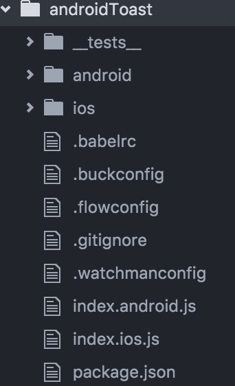
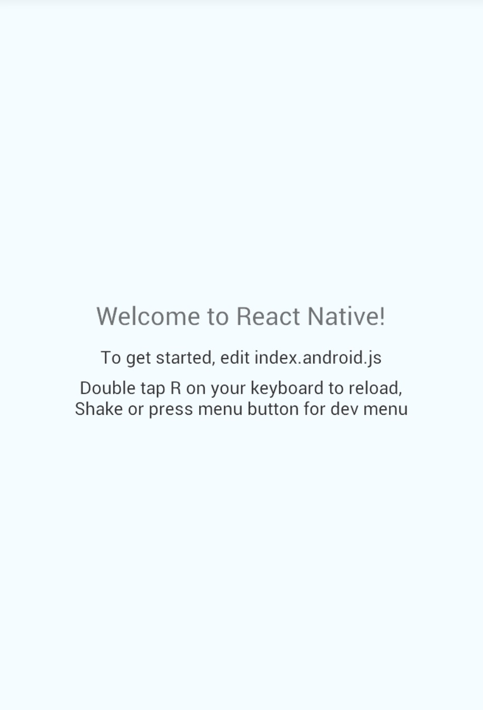
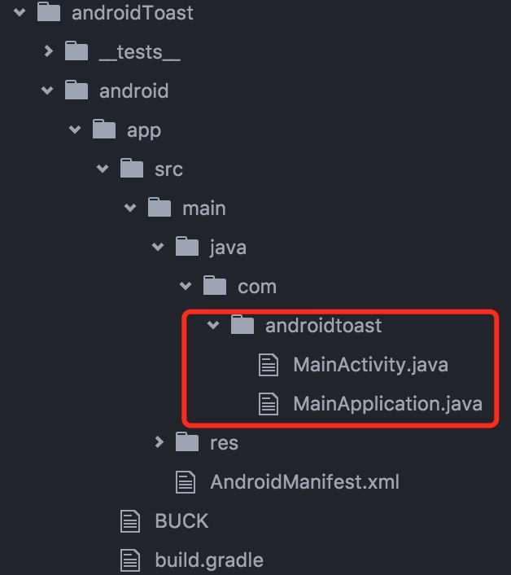
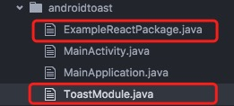
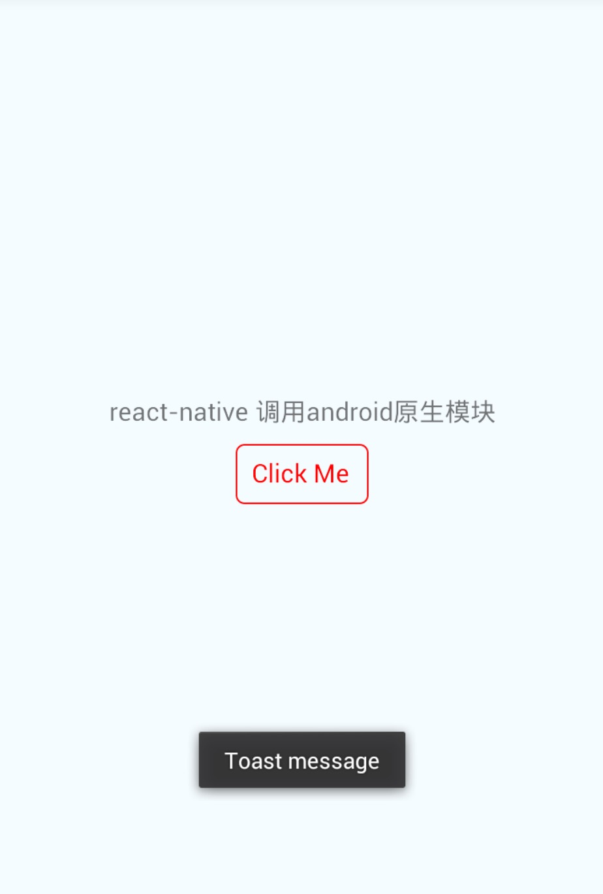
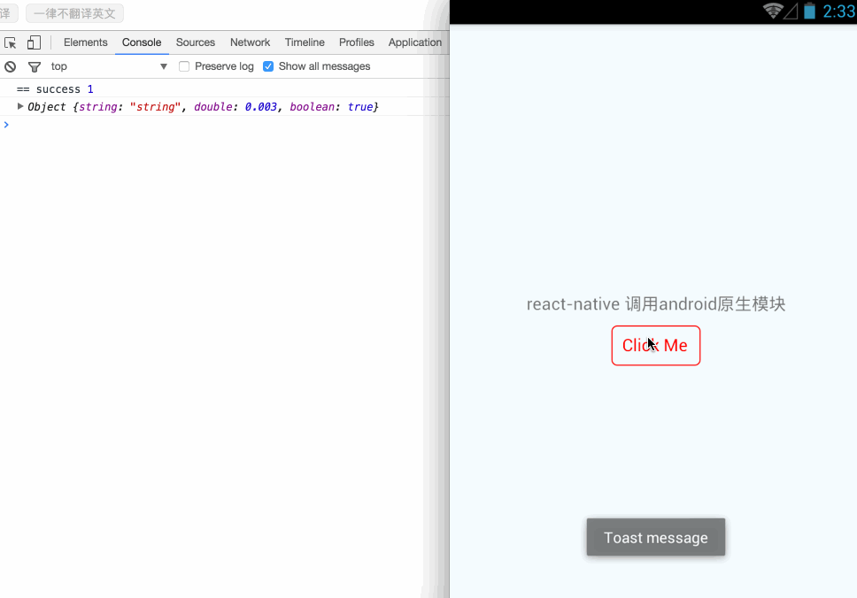
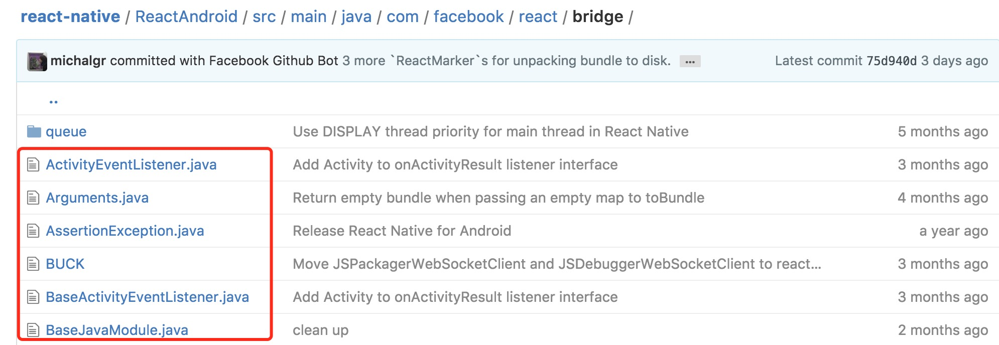

# react-native-android-toast

react-native 调用原生 `android` 模块 `Toast` 学习笔记

- [初始化react-native项目](## 参考官方文档初始化一个react-native项目)
- [运行命令查看项目](## 运行命令查看项目)
- [接入Android原生模块](## 接入Android原生模块)
  - [android目录结构](### android目录结构)
  - [Java & ReactNative 基本类型对照](### Java & ReactNative 基本类型对照)
  - [第一步：创建模块类](### 第一步：创建模块类)
  - [第二步：注册模块](### 第二步：注册模块)
  - [第三步：添加注册类](### 第三步：添加注册类)
  - [第四步：修改react-native代码引入原生模块](### 第四步：修改react-native代码引入原生模块)
- [运行程序](## 运行程序)  
- [回调函数](## react-native回调函数)
- [触发事件](## 触发事件)
- [曾走过的路](## 曾走过的路)
- [参考文档](## 参考文档)


## 参考官方文档初始化一个react-native项目
[初始化项目](https://facebook.github.io/react-native/docs/getting-started.html)   

```shell
react-native init androidToast
```

生成如下目录：  


## 运行命令查看项目
```shell
react-native run-android
```
### 如图：


## 接入Android原生模块
*按照官方的说法，第一步需要创建一个java类`本例中为：ToastModule`，并继承`ReactContextBaseJavaModule`，然后复写`getName()`方法，其返回值，就是在`react-native`中引用的`组件名称`*  

*复写 `getConstants()`方法可以返回一些`常量`用于react-native中调用，官方文档中 `return "ToastAndroid" 这个名称在原生的组件中已经存在，返回相同的名称将会冲突，so:改个名字吧！！`*  

*`@ReactMethod`注解：用于java返回一个`react-native`中可调用的`方法` ，其不能有返回值所以使用 `void`*

*注册模块：创建java类`本例中为：ExampleReactPackage`，实现`ReactPackage`接口*  

*复写createJSModules() , createViewManagers() 方法，返回`Collections.emptyList()`空集合*

*`createNativeModules()`方法中添加我们需注册的模块对象，`new ToastModule()`,并返回模块集合*  

*添加已注册模块对象到返回集合中，向react-native抛出模块，如：第三步*

*在react-native中调用，如：第四步*


### android目录结构


### 注意：引入包的名称不要弄错了

### Java & ReactNative 基本类型对照

| Java | RN |
|:------|:------|
|Boolean|Bool|
|Integer|Number|
|Double|Number|
|Float|Number|
|String|String|
|Callback|function|
|ReadableMap|Object|
|ReadableArray|Array|


### 第一步：创建模块类
在androidtoast目录下，创建一个ToastModule.java的类  

```java
package com.androidtoast; //包名

import android.widget.Toast; //引入调用的类

import com.facebook.react.bridge.ReactApplicationContext;
import com.facebook.react.bridge.ReactContextBaseJavaModule;
import com.facebook.react.bridge.ReactMethod;
import com.facebook.react.uimanager.IllegalViewOperationException;

import java.util.Map;
import java.util.HashMap;

public class ToastModule extends ReactContextBaseJavaModule {

    private static final String DURATION_SHORT_KEY = "SHORT";
    private static final String DURATION_LONG_KEY = "LONG";

    public ToastModule(ReactApplicationContext reactContext) {
        super(reactContext);
    }

    // 复写方法，返回react-native中调用的 组件名
    @Override
    public String getName() {
        return "ToastNative";
    }
    // 复写方法，返回常量
    @Override
    public Map<String, Object> getConstants() {
        final Map<String, Object> constants = new HashMap<>();
        constants.put(DURATION_SHORT_KEY, Toast.LENGTH_SHORT);
        constants.put(DURATION_LONG_KEY, Toast.LENGTH_LONG);
        return constants;
    }
    // 使用 @ReactMethod注解返回react-native中可调用的 方法
    @ReactMethod
    public void show(String message, int duration) {
        Toast.makeText(getReactApplicationContext(), message, duration).show();
    }
}

```

### 第二步：注册模块
在androidtoast目录下，创建一个ExampleReactPackage.java的类  

```java

package com.androidtoast;

import android.widget.Toast;

import com.facebook.react.bridge.NativeModule;
import com.facebook.react.bridge.ReactApplicationContext;
import com.facebook.react.bridge.ReactMethod;
import com.facebook.react.ReactPackage;
import com.facebook.react.bridge.JavaScriptModule;
import com.facebook.react.uimanager.ViewManager;

import java.util.ArrayList;
import java.util.Collections;
import java.util.List;

public class ExampleReactPackage implements ReactPackage {

    @Override
    public List<Class<? extends JavaScriptModule>> createJSModules() {
        return Collections.emptyList();
    }

    @Override
    public List<ViewManager> createViewManagers(ReactApplicationContext reactContext) {
        return Collections.emptyList();
    }

    @Override
    public List<NativeModule> createNativeModules(
            ReactApplicationContext reactContext) {
        List<NativeModule> modules = new ArrayList<>();

        modules.add(new ToastModule(reactContext));

        return modules;
    }
}

```
### 第三步：添加注册类
*添加到 `MainApplication.java` 中的`getPackages()`方法中*

```java
@Override
protected List<ReactPackage> getPackages() {
  return Arrays.<ReactPackage>asList(
      new MainReactPackage(), // 这个是自动创建
      new ExampleReactPackage() // 这个类是我们创建的
  );
}
```

项目结构如下：  
  

*Java部分的代码就结束了，再次提醒下：包名啊！！不要弄错了！！！*

### 第四步：修改react-native代码引入原生模块

#### 修改index.android.js
* 引入react-native所需模块 `NativeModules`  
* 获取导出组件`NativeModules.ToastNative`  
* 调用方法`show()`

*修改了下index.android.js文件，代码如下：*
```js
/**
 * Sample React Native App
 * https://github.com/facebook/react-native
 * @flow
 */

import React, { Component } from 'react';
import {
  AppRegistry,
  StyleSheet,
  Text,
  View,
  TouchableOpacity,
  NativeModules
} from 'react-native';

let toast = NativeModules.ToastNative;

export default class androidToast extends Component {
  render() {
    return (
      <View style={styles.container}>
        <Text style={styles.title}>react-native 调用android原生模块</Text>
        <TouchableOpacity onPress={()=>{
          toast.show('Toast message',toast.SHORT);
        }}>
          <Text style={styles.btn}>Click Me</Text>
        </TouchableOpacity>
      </View>
    );
  }
}

const styles = StyleSheet.create({
  container: {
    flex: 1,
    justifyContent: 'center',
    alignItems: 'center',
    backgroundColor: '#F5FCFF',
  },
  title:{
    fontSize:16,
  },
  btn:{
    fontSize:16,
    paddingVertical:7,
    paddingHorizontal:10,
    borderColor:'#f00',
    borderWidth:1,
    borderRadius:5,
    marginTop:10,
    color:'#f00'
  }
});

AppRegistry.registerComponent('androidToast', () => androidToast);

```

## 运行程序

```shell
react-native run-android

```

### 效果如下：



## react-native回调函数

*java中提供了一个 `Callback` 的数据类型对应了react-native中的 `function` *  

*具体操作就是在@ReactMethod注解的返回函数中 添加`类型`为 `Callback`的参数，并通过 `invoke(...params)`调用*  

*RN中通过调用show方法时提供对应的回调函数就可以了，😄*

- 修改`ToastModule.java`代码中`show()`方法，添加回调

*注意引包！！ import com.facebook.react.bridge.Callback;*

```java
// 说明下：count，flag是我自定义的变量

@ReactMethod
public void show(String message, int duration ,Callback successCallback, Callback errorCallback) {
    Toast.makeText(getReactApplicationContext(), message, duration).show();
    // 通过invoke调用，随便你传参
    if(flag) successCallback.invoke("success", ++count);
    else errorCallback.invoke("error", ++count);
    flag = !flag;
}

```

- 修改`index.android.js`中调用函数  

```js

<TouchableOpacity onPress={()=>{
  toast.show('Toast message',toast.SHORT,(message,count)=>{console.log("==",message,count)},(message,count)=>{console.log("++",message,count)});
}}>

```
👌，试试看吧～～

## 触发事件

*首先我们定义一个发送事件的方法*

```java

private void sendEvent(ReactContext reactContext, String eventName, @Nullable WritableMap params){
    reactContext
    .getJSModule(DeviceEventManagerModule.RCTDeviceEventEmitter.class)
    .emit(eventName, params);
}

```

*引包*

```java
import javax.annotation.Nullable;

import com.facebook.react.bridge.Arguments;
import com.facebook.react.bridge.WritableMap;
import com.facebook.react.bridge.ReactContext;

import com.facebook.react.modules.core.DeviceEventManagerModule;
```

*继续改造 `show` 方法，添加参数，并调用预先定义的方法*

```java

// 静态方法
WritableMap map = Arguments.createMap();
map.putBoolean("boolean",true);
map.putDouble("double",0.003);
map.putString("string","string");
sendEvent(this.reactContext, "eventName",map);
```

*改造`index.android.js 啦`,添加事件监听，这里的 `eventName` 就是我们 `sendEvent` 中定义的事件名称*

```js

componentWillMount(){
  DeviceEventEmitter.addListener('eventName',(e)=>{
    console.log(e)
  });
}
```

### 效果如下：



## 曾走过的路

*曾想在返回的方法中定义一个`Object` 类型的变量,但pa! 报错了！！不支持滴,请查看类型对应表格*
```
cloudn't find argument class : Object
```
------
*参照官方文档时，各种类找不到，瞬间醉了！*
```
# 百度吧，一般不管用
# stackoverflow，Google 有时可以搜到，尼玛！英文。。。
# github
# react-native 源码 ！！！这里面有个`ReactAndroid`的目录就是各种`Java`类啦
  react-native/ReactAndroid/src/main/java/com/facebook/

  https://github.com/facebook/react-native
```



## 参考文档
[江清清 ModulesDemo](https://github.com/jiangqqlmj/ModulesDemo)  
[react-native 中文](http://reactnative.cn/docs/0.35/native-modules-android.html#content)  
[react-native 官方英文](https://facebook.github.io/react-native/docs/native-modules-ios.html)  
[RN-Resource-ipk github](https://github.com/ipk2015/RN-Resource-ipk)  
